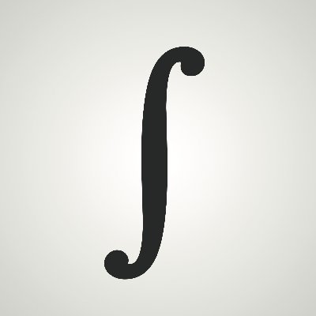

<!-- title -->

<!--lint ignore no-dead-urls-->
# Awesome 1729  

<!-- subtitle -->

A curated list of awesome books, articles, tutorials, podcasts and other resources about the 1729 network state.

<!-- image -->

<!-- description -->

A network state is a social network with an agreed-upon leader, an integrated cryptocurrency, a definite purpose, a sense of national consciousness, and a plan to crowdfund territory.

<!-- TOC -->

## Contents

- [1729 Values](#1729-values)
- [The Network State](#the-network-state)
- [Centralized East - Decentralized West](#centralized-east---decentralized-west)
- [The Ledger of Record](#the-ledger-of-record)
- [Regulation is Information](#regulation-is-information)
- [Crowdchoice](#crowdchoice)
- [Optimalism](#optimalism)
- [Longevity](#longevity)
- [Follow](#follow)

<!-- CONTENT -->

## 1729 Values

1. Win and Help Win
2. Truth, Health, Wealth
3. Learn, Burn, Earn

## The Network State
- [Summary](https://1729.com/summary) - Summary of the key concepts behind the Network State.
- [The Network State](https://1729.com/the-network-state) - Article expaining the key concepts behind the Network State.

## Centralized East - Decentralized West

- [American Anarchy](https://bariweiss.substack.com/p/how-we-changed-our-minds-in-2021) - Article pointing out trends towards an American anarchy.
- [Chinese Control](https://twitter.com/balajis/status/1456136616024494081) - Tweet foreseeing a scenario of American anarchy and Chinese control.

## The Ledger of Record

- [We Are Building the Ledger of Record](https://twitter.com/balajis/status/1459140902144729088) - Twitter Thread by [@balajis](https://twitter.com/balajis).
- [The Ledger of Records](https://www.youtube.com/watch?v=Cwbbxb987vE) - Talk about creating sources of definitive truth with blockchain oracles.
- [The Ledger of Records](https://1729.com/slides/ledger-of-record.pdf) - Slides of the second 1729 lecture.
- [Algorithmic Fact Checking](https://1729.com/slides/algorithmic-fact-checking.pdf) - Slides of the 7th 1729 lecture.
- [The Gray Lady Winked](https://www.goodreads.com/book/show/57844169-the-gray-lady-winked) - Book that analyzes how the New York Times impacts policy, politics and history.

## Regulation is Information

- [Regulation is Information](https://1729-public.s3.amazonaws.com/regulation-is-information.pdf) - Slides of the 6th 1729 lecture.
- [Reputation and Power](https://press.princeton.edu/books/paperback/9780691141800/reputation-and-power) - Book describing how the FDA became the world's most powerful regulatory agency.

## Crowdchoice

- [The Start of Startup Cities](https://1729.com/miami) - Article describing the rising trend of Startup Cities.
- [Silicon Valley's Ultimate Exit](https://www.youtube.com/watch?v=cOubCHLXT6A) - Talk by Balaji Srinivasan about Exit at Y Combinator Startup School in 2013.
- [Exit, Voice and Loyalty](https://www.goodreads.com/en/book/show/149033.Exit_Voice_and_Loyalty) - Book showing different ways of reacting to deterioration.
- [Software Is Reorganizing the World](https://www.wired.com/2013/11/software-is-reorganizing-the-world-and-cloud-formations-could-lead-to-physical-nations/) - Article about online communities becoming physical.
- [The Network Union](https://1729.com/network-union) - Article about the antecedent of the Network State.

## Optimalism

- [Optimalism I](https://1729-public.s3.amazonaws.com/optimalism.pdf) - Slides of the 3rd 1729 lecture.
- [Optimalism II](https://1729-public.s3.amazonaws.com/optimalism-part-2.pdf) - Slides of the 5th 1729 lecture.

## Longevity

- [The Purpose of Technology](https://balajis.com/the-purpose-of-technology/) - Article about why the ultimate purpose of technology is to eliminate mortality.
- [Lifespan](https://lifespanbook.com/) - Book about why we age and why we don't have to.
- [Lifespan with Dr. David Sinclair](https://open.spotify.com/show/3PkkSdQE8DfeiKvSk1Mg1J) - Podcast discussing why we age and interventions for slowing and reversing aging.
- [The Fable of the Dragon-Tyrant](https://www.nickbostrom.com/fable/dragon.html) - Fable about moral reasons for longevity reserach.
- [Vincent Weisser: Longevity](https://www.vincentweisser.com/longevity) - List of resources about longevity.
- [Vincent Weisser: Biohacking](https://www.vincentweisser.com/biohacking) - List of resources about biohacking.

<!-- END CONTENT -->

## Follow

<!-- list people worth following on social sites (Twitter, LinkedIn, GitHub, YouTube etc.) -->

- [Official 1729 Website](https://1729.com/)
- [Official 1729 Twitter](https://twitter.com/oneseventwonine)
- [Official 1729 GitHub](https://github.com/1729)
- [Official 1729 YouTube](https://www.youtube.com/channel/UCG7ZXETdal8d4k9x6p9vYHg)

## Contributing

[Contributions of any kind welcome, just follow the guidelines](contributing.md)!

### Contributors

[Thanks goes to these contributors](https://github.com/suud/awesome-1729/graphs/contributors)!
